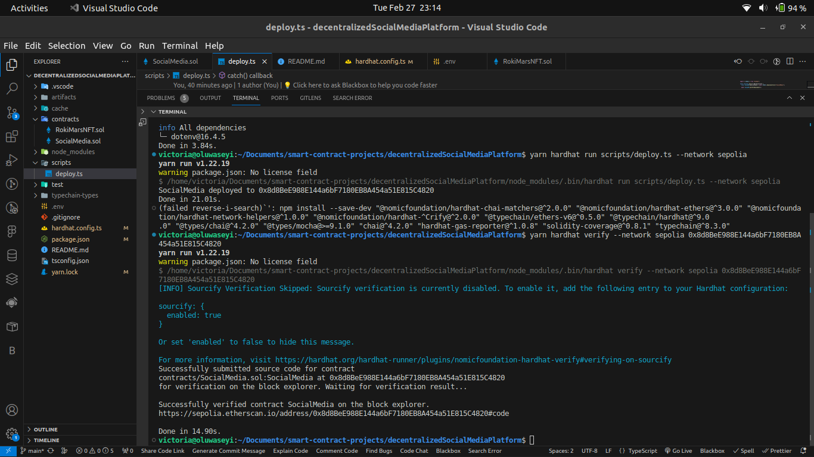

# Cohort X Smart Contract Week Day One

### Question 01

Develop a decentralized social media platform where users can create and share content in the form of NFTs representing multimedia assets such as images, videos, and audio clips. The platform should incorporate advanced features such as user authentication, role-based access control (RBAC), and content moderation.

Features:

- Integrate an authentication mechanism to verify the identity of users.
- Ensure you make use of factory contracts for the NFT creation features
- All NFT interactions must be done via the social media contract.
- Implement role-based access control (RBAC) to manage permissions for different user roles.
- Ensure that sensitive functions are only accessible to authorized users.
- Implement the creation of groups/ communities on the platform
- Implement features for users to discover and interact with content, including searching, and commenting on NFTs.
- Implement a gasless transaction mechanism whereby users do not pay for gas while using the platform
- Deploy to a testnet and ensure your contract is verified.
- ALL FEATURES SHOULD BE IMPLEMENTED WITH SOLIDITY (NO DAPP)

```shell
yarn install
yarn hardhat compile
yarn hardhat help
yarn hardhat test
REPORT_GAS=true yarn hardhat test
yarn hardhat node
yarn hardhat run scripts/deploy.ts
```



[Link to verified contract on Etherscan](https://sepolia.etherscan.io/address/0x8d8bee988e144a6bf7180eb8a454a51e815c4820)
